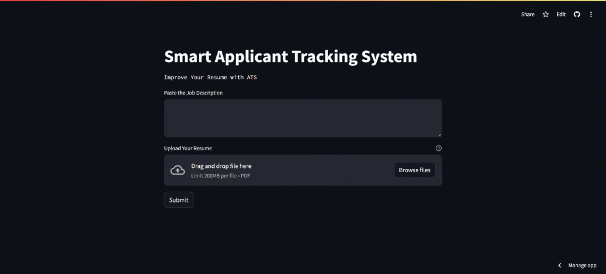

# 📝 Applicant Tracking System (ATS)

Welcome to the **Applicant Tracking System (ATS)** project! This intelligent system evaluates resumes against job descriptions using cutting-edge AI models. By integrating ATS functionality, this application provides users with a detailed analysis of their resume, identifying keyword matches, missing skills, and suggestions to enhance their profiles.

## Preview




## 🚀 Introduction & Objective

The **Applicant Tracking System (ATS)** is designed to help job seekers improve their resumes to better match job descriptions. The system leverages Google’s **Gemini Model** for natural language processing and advanced data analysis techniques to simulate how an ATS evaluates resumes. 

The primary objective is to ensure that users have resumes optimized for ATS systems used by companies, increasing their chances of landing an interview. The app provides:

- **Percentage match** between the resume and job description.
- **Missing keywords** that are essential for a particular job.
- A comprehensive **profile summary** with strengths and weaknesses.
- **Interactive features** to generate professional feedback.

## 🎯 Features

- Analyze resumes and **match** them with job descriptions.
- Extract **missing keywords** required for the job.
- Display a detailed **profile summary** including strengths and improvement areas.
- **Streamlit-based interface** for easy interaction.

## 🧑‍💻 Technologies Used

- **Python** for backend development.
- **Streamlit** for building the web interface.
- **Google Generative AI** (Gemini model) for resume analysis.
- **PyPDF2** for extracting text from PDF resumes.

## 🛠️ How to Run the Project

1. **Fork or Clone the repository** to your local machine.
2. Install **Python 3.x**.
3. Install the dependencies from the `requirements.txt` file using:

   ```bash
   pip install -r requirements.txt
4. Run the Streamlit app using the command:
   ```bash
   streamlit run app.py
5. The app will be hosted on localhost:8501 by default. Open the link in your browser to start interacting with the application.

# 🌐 Deployed Application
Check out the live version of the app on Streamlit: [Applicant Tracking System (ATS) - Live App](https://applicant-tracking-system-ats.streamlit.app/)

## 🤝 Contribute
We welcome contributions from the community! Feel free to fork the repository, submit issues, and create pull requests to enhance the project.
